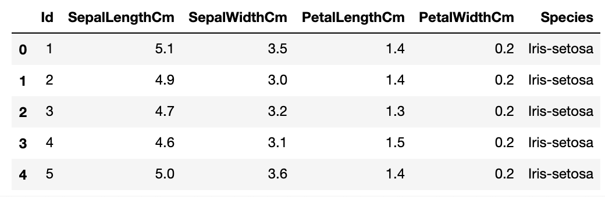
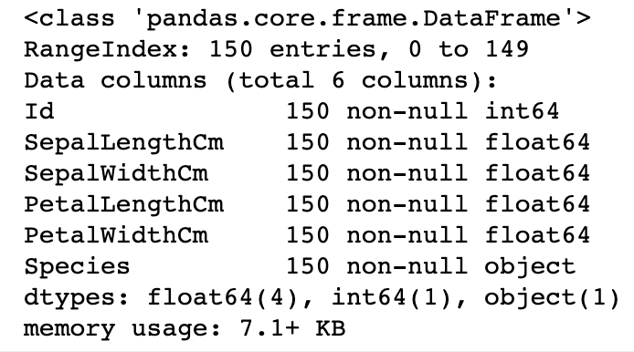
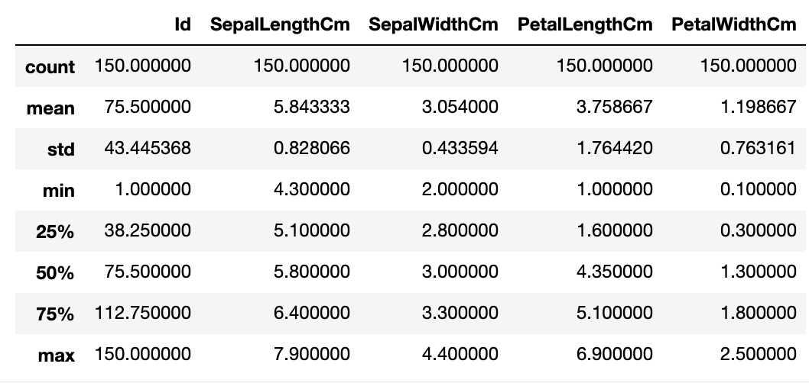
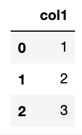

**Pandas:** Python에서 데이터처리를 위해 존재하는 가장 인기있는 라이브러리.
2차원 데이터를 효율적으로 가공/처리할 수 있는 다양하고 훌륭한 기능을 제공
{: .notice--warning}

## Pandas의 핵심 객체 = DataFrame
- 여러 개의 행과 열로 이뤄진 2차원 데이터를 담는 데이터 구조체
- Index : 개별 데이터를 고유하게 식별하는 key값. Series, DataFrame은 모두 Index를 key값으로 가지고 있습니다.
- Series : 열이 하나뿐인 데이터 구조체
- DataFrame : 열이 여러개인 데이터 구조체. DataFrame은 여러개의 Series로 이뤄졌다고 할 수 있습니다.

```python
import pandas as pd
```


# DataFrame

### read_csv( )
파일 로딩하기

- csv : 열을 콤마(,)로 구분
- 콤마 외에 다른 문자로 구분하려면 : read_csv(‘파일명’, sep=‘\t’)
- read_table( ) : 열을 탭으로 구분 / read_fwf( ) : Fixed Width도 있지만, read_csv와 큰 차이 없으므로 read_csv( )를 주로 사용합니다.

```python
df = pd.read_csv('C:/Users/.../train.csv')
```



csv 파일을 로딩해 DataFrame 객체로 반환합니다. 별다른 파라미터 지정이 없으면 csv 파일의 첫번째 줄에 있던 문자열을 칼럼명으로 인지합니다.

맨 왼쪽의 0,1,2,3,… 숫자들이 Pandas의 Index 값입니다. 모든 DataFrame 내의 데이터는 생성되는 순간 고유의 Index값을 가지게 됩니다.

# Explore DataFrame

### df.head(N)
DataFrame의 맨 앞에 있는 N개의 행 표시하기 (아무것도 입력안하면 기본값 5개)

### df.shape
df 크기 알아보기. 행과 열을 tuple 형태로 반환.

### df.info( )
총 데이터 건수, 데이터 타입, Null 건수 등


### df.describe( )
- 숫자형 데이터값의 분포도, 평균값, 최대값, 최소값 등
- 오직 숫자형 열만 조사. object 타입의 열은 자동으로 출력에서 제외시킴


### df[‘column’].value_counts( )
- 해당 열 데이터값의 유형과 건수 확인하기
- df[ ] 안에 열명 입력하면 Series 형태로 특정 열의 데이터셋이 반환됨
- value_counts는 DataFrame 전체에는 적용 안되고 Series에만 적용됨. 그래서 df[ ] 이렇게 해당 열을 지정해줘야함


# DataFrame을 다른 형태로 상호 변환하기
## ndarray, 리스트, 딕셔너리 → DataFrame로 변환하기
DataFrame은 column명을 가지고 있어서, DataFrame으로 변환시 이 column명을 지정해줘야 합니다. (미지정시 자동으로 column명을 할당)

```python
colname = ['col1']
 
# 리스트를 이용해 DataFrame 생성 (columns인자로 column명 지정)
df_list = pd.DataFrame([1, 2, 3], columns=colname)
 
# NumPy ndarray를 이용해 DataFrame 생성
df_array = pd.DataFrame(np.array([1, 2, 3]), columns=colname)
```



```python
colname = ['col1', 'col2', 'col3']
 
df_list = pd.DataFrame([[1, 2, 3], [11, 12, 13]], columns=colname)
df_array = pd.DataFrame(np.array([[1, 2, 3], [11, 12, 13]]), columns=colname)
```


### 딕셔너리를 DataFrame으로 변환
- key값은 column명으로, value값은 해당 column의 데이터로 변환됩니다.
- key는 문자열로, value는 리스트나 ndarray 형태로 딕셔너리를 구성합니다.

```python
dict = {'col1':[1, 11], 'col2':[2, 22], 'col3':[3, 33]}
df_dict = pd.DataFrame(dict)
```


## DataFrame → ndarray, 리스트, 딕셔너리로 변환하기

### df.values
DataFrame → ndarray

```python
arr = df.values
 
>>> arr
[[ 1,  2,  3],
 [11, 22, 33]]   # NumPy의 ndarray 타입으로 변환됨
```

### df.values.tolist( )
DataFrame → 리스트
- values로 얻은 ndarray에 tolist( ) 호출

```python
lis = df.values.tolist()
 
>>> lis
[[1, 2, 3], [11, 22, 33]]
```

### df.to_dict(‘list’)
DataFrame → 딕셔너리
- 인자로 ‘list’ 입력하면 딕셔너리의 value값이 리스트형으로 반환
- 인자로 아무것도 입력안하면 value값이 딕셔너리

```python
dict = df.to_dict('list')
 
>>> dict
{'col1':[1, 11], 'col2':[2, 22], 'col3':[3, 33]}
 
dict = df.to_dict()
 
>>> dict
{'col1': {0: 1, 1: 11}, 'col2': {0: 2, 1: 22}, 'col3': {0: 3, 1: 33}}
```

# DataFrame 생성, 수정, 삭제

### 새로운 column 추가하기

- 새로운 series가 기존 DataFrame에 추가됨
- Series에 상수값을 할당하면 모든 데이터값이 일괄적으로 적용됨
- 기존 column의 데이터를 이용해 새로운 series를 만들수도 있음

```python
df['new'] = 0
df['age'] = 2019 - df['born']
df['age_by_10'] = df['age'] * 10
```

### 기존의 column 데이터값 일괄 수정하기
```python
df['age_by_10'] = df['age_by_10'] + 100
```

### DataFrame 데이터 삭제하기
```python
df.drop(labels=None, axis=0, inplace=False)
 
# 'name, age, address' column이 삭제된 df를 반환
drop_df = df.drop(['name', 'age', 'address'], axis=1)
```

- labels : 삭제 원하는 행의 인덱스값 or column명 입력
- axis : axis=0 행 삭제, axis=1 열 삭제
- inplace
    - 기본값 False → 원래 DataFrame은 그대로 유지하고, drop된 DataFrame을 새로운 객체변수로 반환
    - inplace=True → 원래 DataFrame의 데이터를 삭제하고 drop된 결과를 새롭게 적용. 반환되는 값은 None


# Index 객체

### df.index
Index 객체값 확인하기
### df.index.values
Index 객체의 ndarray 값 확인하기
### df.reset_index( )
새롭게 인덱스를 연속 숫자형으로 할당. 기존 인덱스는 ‘index’라는 새로운 column명으로 추가합니다.

Parameter값으로 drop=True 설정하면 기존 인덱스가 새로운 칼럼으로 추가되지 않고 삭제됨
{: .notice--info}


# Data Selection & Filtering

### [ ] 연산자

- DataFrame 뒤의 [ ]에 칼럼을 지정해 칼럼 지정 연산에 사용
    - ex) df[‘age’]
- Index 형태로 변환가능한 표현식 (슬라이싱 or Boolean 인덱싱) 은 [ ]내에 입력 가능.
    - df[ 0:2 ] : 첫 2개 데이터 행을 추출 → 가능은 하지만 이렇게 슬라이싱해서 데이터 추출하는 방식은 비추!
    - df[ df[‘age’] == 30 ] : age열 값이 30인 데이터만 추출

DataFrame[ ]에는 칼럼 지정 or Boolean 인덱싱으로만 사용할 것 !!!
{: .notice--danger}

### ix[ ] 연산자
ix[행, 열] like ix[0, 'age'] = 0번째 행 + 'age'열에 해당하는 데이터값 추출

- 행 : 행의 index값
- 열 : 칼럼명 or 칼럼 index값

**주의:** 칼럼명과 칼럼의 index값 두개가 혼용되어 ix 연산자는 곧 사라지고, loc[ ]과 iloc[ ]으로 나뉘어짐
{: .notice--danger}

### iloc[ ] 연산자 : 칼럼 위치(position) 기반 인덱싱
행,열 값으로 int or 슬라이싱 or 팬시리스트를 입력해야 함

```python
df.iloc[0, 0]   # 1번째 행, 1번째 열 값
df.iloc[0, 'Name']   # 오류발생
```

### loc[ ] 연산자 : 칼럼명(label) 기반 인덱싱


