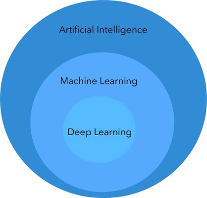
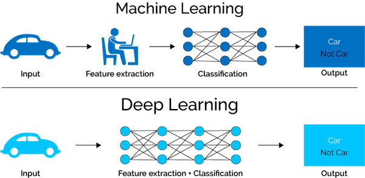

## 머신러닝이란?
- 컴퓨터가 무슨 일을 할지 인간이 프로그래밍하지 않아도, 컴퓨터가 ‘스스로’ 데이터로부터 학습하게 하는 기술.
- 데이터를 기반으로 패턴을 학습하고 결과를 예측하는 알고리즘 기법

## 머신러닝 vs 딥러닝

머신러닝에서는 인풋에서 중요한 feature값이 무엇인지 사람이 직접 골라서 학습시켜야 하지만, 딥러닝에서는 여러 layer로 이루어진 신경망을 통해 스스로 feature값을 추출해 학습한다.

## 머신러닝의 분류
### Supervised learning (지도학습)
label이 달린 샘플로 모델을 학습시킨 후에, 학습된 모델로 label이 없는 새로운 샘플을 예측하는 것.

ex) 크기가 100, 3층짜리 집의 가격이 1000/ 크기가 50, 2층짜리 집의 가격이 600일 경우, 크기가 70, 2층짜리 집의 가격은?

여기서, 집의 크기과 층수는 모델을 학습시키기 위한 feature에 해당하고, 각 집의 가격 1000, 600이 각 데이터의 label값이 된다. 이런 데이터들을 가지고 학습된 모델을 새로운 데이터에 적용하면 새로운 집의 가격 750을 예측할 수 있게 된다.

- 분류
- 회귀
- 추천시스템
- 시각/음성 감지/인지
- 텍스트 분석, NLP

### Unsupervised learning (비지도학습)
훈련시킬 데이터에 label값이 없는 경우이다.

- Clustering
- 차원 축소
- 특성 추출 (Feature Extraction)

### Reinforcement learning (강화학습)

## Data set
- **Train(훈련) set** : 학습을 위해 주어진 데이터셋
- **Test(테스트) set** : 머신러닝 모델의 성능을 평가하기 위해 주어진 데이터셋

## 머신러닝의 작동원리
모델을 학습시킨다 = 모델이 잘 작동하는 파라미터(가중치, 편향값)를 찾는다

### Hyperparameter
머신러닝 알고리즘별로 최적의 학습을 위해 직접 입력하는 파라미터들. Hyperparameter를 통해 알고리즘 성능을 튜닝할 수 있다.

## Classification (분류) vs Regression (회귀)

### 분류
- 카테고리로 나눠서 예측. 손글씨 숫자를 보고 이 숫자가 0인지 3인지 9인지 예측하는 것.
- 2개로 나누는건 Binary classification, 여러 개로 나누는건 Multi-class classification에 해당한다.
- 영화 리뷰를 학습해 사용자가 새로운 영화를 좋아할지 안 좋아할지 구분하는 것은 좋아하거나(1) 안 좋아하거나(0) 둘 중 하나이므로, Binary 분류에 해당한다.

### 회귀
- 연속적인 값을 예측. 위의 집 가격 예시처럼 값을 예측할 때.
- 또는, 1~2차 시험의 성적이 각각 80,90/100,90/60,65/90,85 인 경우, 3차 시험의 성적을 예측할때.

## 머신러닝 기법들
- SVM
- k-Means
- Logistic Regression
- k-NN
- Random Forest
- Decision Tree

## Feature vs Label
### 특성(Feature)
입력변수 x

### 레이블(Label)
예측하는 항목 y (Supervised 학습에만 존재) → x의 입력을 받아 y를 출력

## 머신러닝 언어 : Python vs R
### Python
- 직관적인 문법, 객체지향과 함수형 프로그래밍 모두를 포괄
- 앞으로도 딥러닝 framework는 python 중심으로 발전될 것임
- for 현업 개발자이거나 머신러닝을 시작하려는 사람

### R
- 통계전용 프로그램 언어
- for 개발 언어에 익숙하지 않으나 통계 분석에 능한 현업 사용자

## Python 기반의 머신러닝을 위한 Package
- 머신러닝 패키지 : Scikit-learn
- 딥러닝 라이브러리 : TensorFlow, Keras
- 행렬/선형대수/통계 패키지 : NumPy → 행렬 기반의 데이터처리에 특화
- 데이터 핸들링 : Pandas → 2차원 데이터처리에 특화
- 시각화 : Matplotlib, Seaborn
- 대화형 Python 툴 : Jupyter Notebook

## 머신러닝의 단점
> Garbage In, Garbage out.

데이터에 매우 의존적이다. 좋은 품질의 데이터를 갖추지 못하면 머신러닝의 결과도 좋을 수 없다. 데이터를 이해하고 효율적으로 가공,처리,추출해 알고리즘이 잘 작동하도록 최적의 데이터를 준비하는 능력이 중요.
