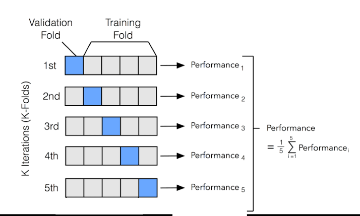

**Scikit-learn:** Python 머신러닝 라이브러리 중 가장 많이 사용되는 라이브러리. 
{: .notice--warning}

```python
import sklearn
```

# 머신러닝의 분류 프로세스 (지도학습)
1. Train셋/Test셋으로 **데이터 분리** = `train_test_split( )`
1. 머신러닝 알고리즘을 적용해 Train셋으로 **모델학습** = `fit( )`
1. 학습된 모델을 통해 Test셋의 label값 **예측** = `predict( )`
1. 예측된 label값과 실제 값을 비교해 모델 성능을 **평가** = `accuracy_score( )`

## 모델학습 순서

### 지도학습의 기본 템플릿

```python
# 1. Estimator 생성
clf = DecisionTreeClassifier()

# 2. 모델 학습
clf.fit(X_train, y_train)

# 3. 예측
pred = clf.predict(X_test)

# 4. 평가
print(accuracy_score(y_test, pred))
```

### 비지도학습
> Estimator생성 → fit( ) → transform( )

- **fit( )** : 인풋 형태에 맞춰 데이터를 변환하기 위한 사전 구조를 맞추는 작업
- **transform( )** : fit( )으로 사전 구조를 맞추면 실제 작업은 transform( )으로 수행

sklearn은 fit( )과 transform( )을 동시에 수행하는 **fit_transform( )**을 제공함
{: .notice--info}


## Estimator 클래스
지도학습의 모든 알고리즘을 구현한 클래스를 통칭

### Classifier
분류 알고리즘 구현한 클래스
- DecisionTreeClassifier
- RandomForestClassifier
- GradientBoostingClassifier
- GaussianNB
- SVC

### Regressor
회귀 알고리즘 구현한 클래스
- LinearRegression
- Ridge
- Lasso
- RandomForestRegressor
- GradientBoostingRegressor

# 사이킷런의 주요 핵심 모듈

| 분류         | 모듈명           | 설명     |
|:-----------:|----------------|---------|
| Feature 처리 | sklearn.preprocessing | 데이터 전처리 |
|             | sklearn.feature_selection | 중요한 feature를 우선순위대로 선택 |
|             | sklearn.feature_extraction | Feature 추출 |
| Feature 처리 & 차원축소 | sklearn.decomposition | 차원축소 알고리즘 |
| 데이터분리,검증,파라미터튜닝 | sklearn.model_selection | 교차검증을 위한 Train/Test용 분리|
| 평가 | sklearn.metrics | 성능 측정 |
| ML 알고리즘 | sklearn.ensemble | 앙상블 알고리즘 |
|           | sklearn.linear_model | 회귀 관련 알고리즘 |
|           | sklearn.naive_bayes | 나이브 베이즈 알고리즘 |
|           | sklearn.neighbors | k-NN |
|           | sklearn.svm | SVM 알고리즘 |
|           | sklearn.tree | Decision Tree 알고리즘 |
|           | sklearn.cluster | 비지도 clustering 알고리즘 |
| 유틸리티    | sklearn.pipeline | 데이터 변환, 학습, 예측 등을 묶어서 실행 |

# Model Selection 모듈

## train_test_split( )
Train/Test 데이터셋 분리

```python
from sklearn.model_selection import train_test_split

X_train, X_test, y_train, y_test = train_test_split(data, target,
                                                    test_size=0.2, random_state=42)
```

### train_test_split(feature, label, -optional-)
optional 파라미터들
- **test_size** : test셋 크기 (기본값=0.25)
- **train_size** : train셋 크기. 이거보단 `test_size`를 주로 씀.
- **shuffle** : 데이터를 미리 섞을지 (기본값=True)
- **random_state** : 호출할 때마다 동일한 데이터셋을 생성하기 위한 난수 값


# 교차 검증
Train 데이터셋을 Train셋/검증셋으로 분할하여 검증셋으로 모델의 성능을 1차적으로 평가함. 모든 학습과 검증 과정이 완료되면 최종적으로 Test셋으로 성능을 평가함. 오버피팅을 막기 위해 모델을 미리 검증해보는 별도의 데이터 (수능 보기전에 미리 모의고사 보는것처럼)

**오버피팅(Overfitting)** : 모델이 학습셋에만 과도하게 최적화되게 학습되어서 새로운 데이터에는 제대로 예측을 하지 못하는 현상
{: .notice--info}

## K폴드 교차 검증
- 데이터셋을 k등분
- k개의 데이터폴드 세트를 만들어서
- k번만큼 검증폴드를 바꿔가며 각 세트에 학습/검증평가를 반복적으로 수행
- k개의 검증평가 결과를 구한뒤, 이를 평균



```python
from sklearn.model_selection import KFold

kf = KFold(n_splits=5)
accs = []

# kf.split() : fold별 학습셋, 검증셋의 index를 array로 반환
for train_index, test_index in kf.split(X):

  # 반환된 index로 학습셋, 검증셋 추출
  X_train, X_test = features[train_index], features[test_index]
  y_train, y_test = label[train_index], label[test_index]

  # 학습 & 예측
  clf = DecisionTreeClassifier()
  clf.fit(X_train, y_train)
  pred = clf.predict(X_test)

  # 정확도 측정해서 accs 리스트에 추가
  acc = np.round(accuracy_score(y_test, pred), 4)
  accs.append(acc)

# 5개 폴드의 평균 정확도 계산
mean_acc = np.mean(accs)
```

## Stratified K폴드
